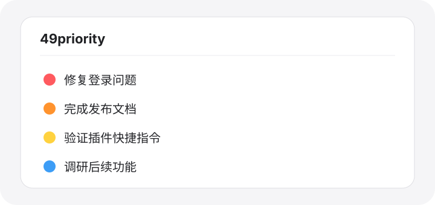

# 49priority


为 Codex 任务列表添加可见的彩色优先级圆点。选择优先级后，插件会自动重命名当前任务，把标记放在标题最前面：



```text
🔴 修复登录问题
🟠 完成发布文档
🔵 调研新的交互方案
🔴 ⚪ 紧急但暂时受阻的任务
```

## 快速开始

安装后，在任意 Codex 对话中直接输入：

```text
$p0
```

当前任务会立即显示为红点优先级。插件也支持在普通话语中触发，例如：

```text
先把这个任务标成 $p1，然后继续处理。
```

## 功能

- 用 `$p0`–`$p6` 快速标记当前 Codex 任务。
- 自动替换已有标记，不会重复叠加圆点。
- 用 `$px` 或 `$pclear` 清除标记。
- 用 `$priority` 打开完整优先级选择提示。
- 用 `$plist` 汇总并按优先级排列最近可见的已标记任务。
- 用 `$pnext` 打开当前可见范围内优先级最高的任务。
- 用 `$phelp` 随时列出全部快捷指令。
- 保留任务原有标题，只修改标题开头的优先级圆点。
- 暂停白点可以单独使用，也可以叠加在 P0–P5 后面。

## 全部快捷指令

| 指令 | 标记 | 含义 |
|---|---|---|
| `$p0` | 🔴 | 紧急 |
| `$p1` | 🟠 | 高 |
| `$p2` | 🟡 | 中 |
| `$p3` | 🟢 | 普通 |
| `$p4` | 🔵 | 低 |
| `$p5` | 🟣 | 有空再做 |
| `$p6` | ⚪ | 暂停；可单独使用或叠加到 P0–P5 |
| `$px` / `$pclear` | — | 清除全部优先级和暂停标记 |
| `$priority` | — | 显示选择提示 |
| `$plist` | — | 列出已标记任务 |
| `$pnext` | — | 打开最高优先级的非暂停任务 |
| `$phelp` | — | 显示全部快捷指令 |

## 使用示例

在新的 Codex 任务中输入：

```text
$p1 修复登录问题
```

任务标题会变成：

```text
🟠 修复登录问题
```

如果标题已经是 `🔵 修复登录问题`，再次输入 `$p0` 后会变成 `🔴 修复登录问题`，不会出现多个圆点。

暂停可以单独标记：

```text
$p6
⚪ 等待外部接口
```

也可以保留原有优先级并叠加暂停：

```text
🔴 修复登录问题 → $p6 → 🔴 ⚪ 修复登录问题
```

再次输入 `$p6` 不会重复添加白点。之后输入 `$p2` 会得到 `🟡 ⚪ 修复登录问题`；`$plist` 仍显示它的优先级并将状态标为暂停，`$pnext` 会跳过它。

清除标记：

```text
$px
```

### 标记其他任务

在消息中引用一个 Codex 任务，再添加优先级命令：

```text
@建议个人网站方案 $p0
```

插件会标红被引用的任务，而不是当前对话。引用多个任务时，可以批量应用同一个优先级；没有任务引用时，命令仍作用于当前任务。

### 汇总并分析工作状态

命令可以放进自然语言中：

```text
帮我分析所有 $plist 目前的工作状态
```

插件会只读汇总已标记任务，按 P0 到 P6 排序，并结合 Codex 的进行中、空闲或未加载状态给出简短分析。

### 调整与清除其他任务

```text
@建议个人网站方案 $p2
@建议个人网站方案 $px
```

第一条会替换原有圆点，第二条只移除标题开头的优先级标记。

## 安装

### 从 GitHub 安装

在终端依次运行：

```bash
codex plugin marketplace add VibeDough/49priority
codex plugin add 49priority@49priority
```

然后重新打开 Codex，并新建一个任务测试 `$p0`。也可以运行下面的命令确认安装状态：

```bash
codex plugin list
```

### 更新

```bash
codex plugin marketplace upgrade 49priority
codex plugin add 49priority@49priority
```

更新后请重新打开 Codex，并在新任务中使用最新功能。

### 卸载

```bash
codex plugin remove 49priority@49priority
codex plugin marketplace remove 49priority
```

以上流程遵循 [Codex 官方插件与 marketplace 说明](https://developers.openai.com/codex/plugins/build)。

## 推荐用法

- 新任务开始时先输入 `$priority`，从完整列表中选择优先级。
- 日常快速标记直接用 `$p0`–`$p6`。
- 忘记指令时输入 `$phelp` 查看完整清单。
- 收尾时用 `$plist` 查看所有已标记任务，再用 `$pnext` 打开最优先的一项。
- 已完成或不再需要排序的任务，用 `$px` 清除圆点。
- 在消息中引用旧任务并附上 `$p0`，可以补标忘记设置优先级的任务。

## 权限与隐私

49priority 不连接外部服务，也不上传任务内容。它只使用 Codex 提供的任务列表、任务标题重命名和任务导航能力；`$plist` 只读查看当前可见任务。

插件包含的主要技能位于 `skills/`，插件清单位于 `.codex-plugin/plugin.json`。

## 工作原理

彩色圆点是任务标题中的 Unicode 字符。技能调用 Codex 的任务标题重命名能力，将对应圆点添加到标题开头，因此它会直接显示在左侧任务列表中。

## 当前限制

- 插件可以自动修改任务和已知子任务的标题。
- 跨任务标记依赖消息中存在可解析的 Codex 任务引用；仅输入普通标题文本时不会猜测目标。
- Codex 当前没有向插件开放项目文件夹标题的自动重命名接口；项目名称仍需在界面中手动修改。
- `$plist` 和 `$pnext` 依赖当前 Codex 表面提供任务列表与导航工具；无法识别项目范围时会使用最近可见任务并明确说明。
- 更新后的新技能在旧任务中不保证立即可用，建议新建任务测试。
